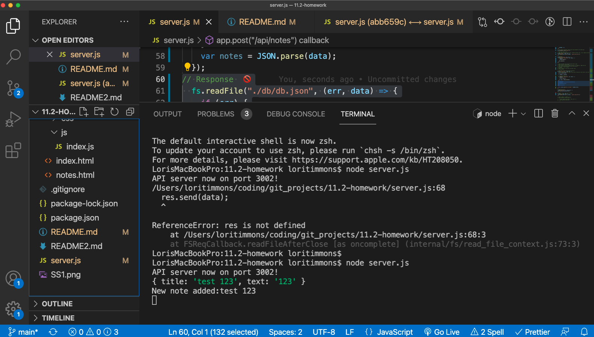

# 11-homework - Lori Timmons 

## Description
This application can be used to write and save notes. 

## Installation
How to use this application. 
* Make a .gitignore file and add your node_modules 
* npm init 
* npm i express.js
## Usage 
 This application will help you write and save notes. 
   

## Test
Test using http://localhost:3002/

## Questions
lorietimmons@gmail.com  
Repo: https://github.com/LoriTimmons/11.2-homework  
Deployed App: https://loritimmons.github.io/11.2-homework/
